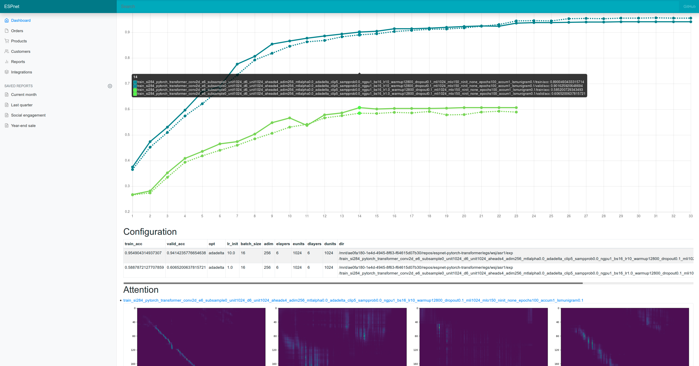

# ESPnet browser

browsing tool for ESPnet experiments

# requirements

- python >= 3.6
- Flask >= 1.0.2
- matplotlib >=3.0.1
- pillow >= 5.3.0

## how to use

```bash
$ pip install flask matplotlib pillow
$ python main.py --exp_root $your_espnet_dir/egs/wsj/asr1/exp
```

then open 127.0.0.1:5000 in your browser

## demo

visit https://shigekikarita.github.io/espnet-browser/


